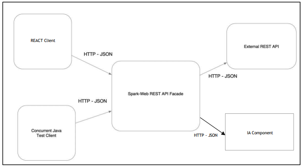
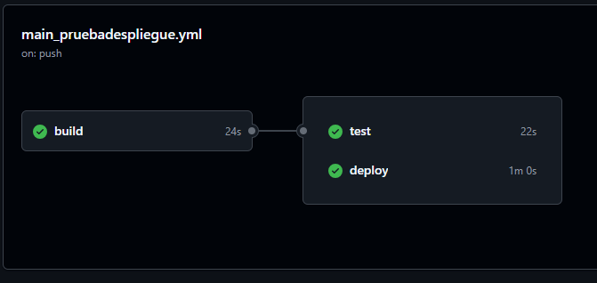
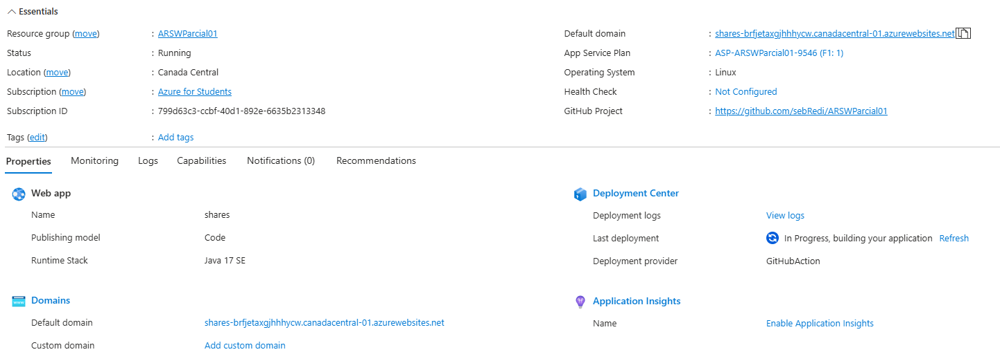

# Parcial ARSW
## Sebastian Galvis Briceño

## Objetivo:
Construir una aplicación para consultar el mercado de valores de las acciones negociadas en Bolsa

La arquitectura a seguir se ilustra en la figura:



## Desarrollo:
Para empezar, llevaremos a cabo la implementación del servicio que se encargará de enviar las peticiones al API
``` java
package com.parcial.app.services;


import com.parcial.app.client.Client;
import com.parcial.app.client.impl.SharesClient;
import org.json.JSONException;
import org.json.JSONObject;
import org.springframework.beans.factory.annotation.Autowired;
import org.springframework.beans.factory.annotation.Qualifier;
import org.springframework.stereotype.Service;

/**
 * Service class for Shares API
 * @author sebastianGalvis
 */
@Service
public class SharesServices {

    /**
     * Injected httpClient
     */
    @Qualifier("sClient")
    private final Client client;

    @Autowired
    public SharesServices(SharesClient client){
        this.client = client;
    }


    /**
     * Obtains the body from the api key
     * @param identifier share's identifier
     * @return share's history
     */
    public JSONObject getHistoryByIdentifier(String identifier) throws Exception {
        try{
            return client.getHistoryByIdentifier(identifier);
        } catch (JSONException e){
            throw e;
        }
    }
}
```
El objetivo de inyectar el cliente http es poder realizar modificaciones a los métodos solicitados de forma escalable.

Intefaz:
``` java
package com.parcial.app.client;


import org.json.JSONException;
import org.json.JSONObject;

/**
 * Injectable interface for http client
 * @author sebastianGalvis
 */
public interface Client{
    public JSONObject getHistoryByIdentifier(String identifier) throws JSONException;
}
```

Implementación:
``` java
package com.parcial.app.client.impl;

import com.parcial.app.client.Client;
import okhttp3.*;
import org.json.JSONException;
import org.json.JSONObject;
import org.springframework.context.annotation.Primary;
import org.springframework.stereotype.Component;

/**
 * Implementation of http client for shares API
 * @author sebastianGalvis
 */
@Primary
@Component("sClient")
public class SharesClient implements Client {

    /**
     * APIKEY: temporally we'll use the 'demo' apikey, real apikey is on "DONTREADME.txt" (not uploaded archive).
     */
    private static final String API_KEY = "demo";
    private static final String API_URL = "https://www.alphavantage.co/query?";
    private OkHttpClient client;

    /**
     * Creates the instance
     */
    public SharesClient() {
        this.client = new OkHttpClient();
    }

    /**
     * Get the history of a share using its identifier (i.e "MCFT")
     * @param identifier share's identifier
     * @return Share's history
     * @throws JSONException if something was wrong with API or API KEY
     */
    public JSONObject getHistoryByIdentifier(String identifier) throws JSONException {
        String FUNCTION = "TIME_SERIES_INTRADAY";
        String SYMBOL = identifier;
        String INTERVAL = "5min";
        String url = API_URL
                + "function="+FUNCTION
                + "&symbol="+SYMBOL
                + "&inverval="+INTERVAL
                + "&apikey="+API_KEY;

        Request request = new Request.Builder()
                .url(url)
                .get()
                .build();

        try (Response response = client.newCall(request).execute()) {
            if (!response.isSuccessful()) {
                throw new Exception("Error en API: " + response);
            }
            String respuesta = response.body().string();
            JSONObject obj = new JSONObject(respuesta);
            return obj;
        } catch (Exception e){
            throw new JSONException("Error en API generando la solicitud");
        }

    }

}
```
Todo esto hecho para recibir la solicitud HTTP a la URL *despliegue/shares/{identifier}* mediante el controlador:
``` java
package com.parcial.app.controllers;

import com.fasterxml.jackson.databind.util.JSONPObject;
import com.parcial.app.services.SharesServices;
import org.json.JSONObject;
import org.springframework.beans.factory.annotation.Autowired;
import org.springframework.http.ResponseEntity;
import org.springframework.web.bind.annotation.*;

/**
 * Controller for Shares Api REST
 * @author sebastianGalvis
 */
@RestController
@RequestMapping("/shares")
public class SharesApiController {

    @Autowired
    private SharesServices sharesServices;

    /**
     * Get history of a share using its identifier
     * @param identifier share's identifier (i.e. "MSFT")
     * @return share's history on a JSON body
     */
    @GetMapping("/{identifier}")
    public ResponseEntity<JSONObject> getHistoryByIdentifier(@PathVariable("identifier") String identifier){
        try {
            JSONObject body = sharesServices.getHistoryByIdentifier(identifier);
            return  ResponseEntity.ok(body);
        } catch (Exception e){
            return ResponseEntity.internalServerError().build();
        }
    }

}
```

## Completitud:
El servidor no se encuentra completamente desarrollado debido a los siguientes factores:
1. Tiempo: Temporalmente, la aplicación únicamente devuelve la información intra-día, para próximas actualizaciones solo sería necesario repetir el procedimiento y ordenar los tipos de históricos como se le deseen mostrar al cliente.
2. Respecto a la implementación de IA por ChatGPT, podría realizarse una clase que aproveche la interfaz ya existente Client, la cual quedaría más o menos de la forma:
``` java
package com.parcial.app.client.impl;
import okhttp3.*;
import org.json.JSONObject;

public class ChatGPTClient {
    private static final String API_KEY = "API_KEY";
    private static final String API_URL = "https://api.openai.com/v1/chat/completions";
    private OkHttpClient client;

    public ChatGPTClient() {
        this.client = new OkHttpClient();
    }

    public String enviarMensaje(String mensaje) throws Exception {
        JSONObject json = new JSONObject();
        json.put("model", "gpt-4o-mini"); // o el modelo que se use
        json.put("messages", new org.json.JSONArray()
                .put(new JSONObject().put("role", "user").put("content", mensaje))
        );

        RequestBody body = RequestBody.create(
                json.toString(),
                MediaType.parse("application/json")
        );

        Request request = new Request.Builder()
                .url(API_URL)
                .post(body)
                .addHeader("Authorization", "Bearer " + API_KEY)
                .build();

        try (Response response = client.newCall(request).execute()) {
            if (!response.isSuccessful()) {
                throw new Exception("Error en API: " + response);
            }
            String respuesta = response.body().string();
            JSONObject obj = new JSONObject(respuesta);
            return obj.getJSONArray("choices")
                    .getJSONObject(0)
                    .getJSONObject("message")
                    .getString("content");
        }
    }
}
```
En ***String message*** podemos enviar el prompt para el análisis de históricos junto a la información recopilada, por motivos de tiempo no se logró implementar pero quedó la base para realizarlo.


## Despliegue
Este repositorio cuenta con integración y despliegie continuos mediante github actions, y el servidor se encuentra corriendo en una instacia de azure cuyo enlace es ***shares-brfjetaxgjhhhycw.canadacentral-01.azurewebsites.net***

